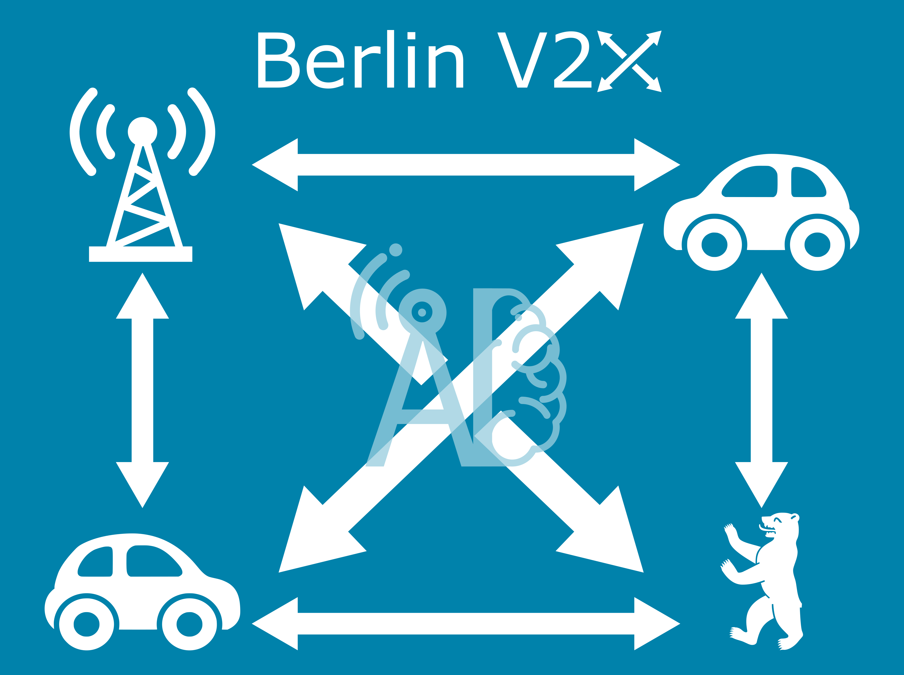
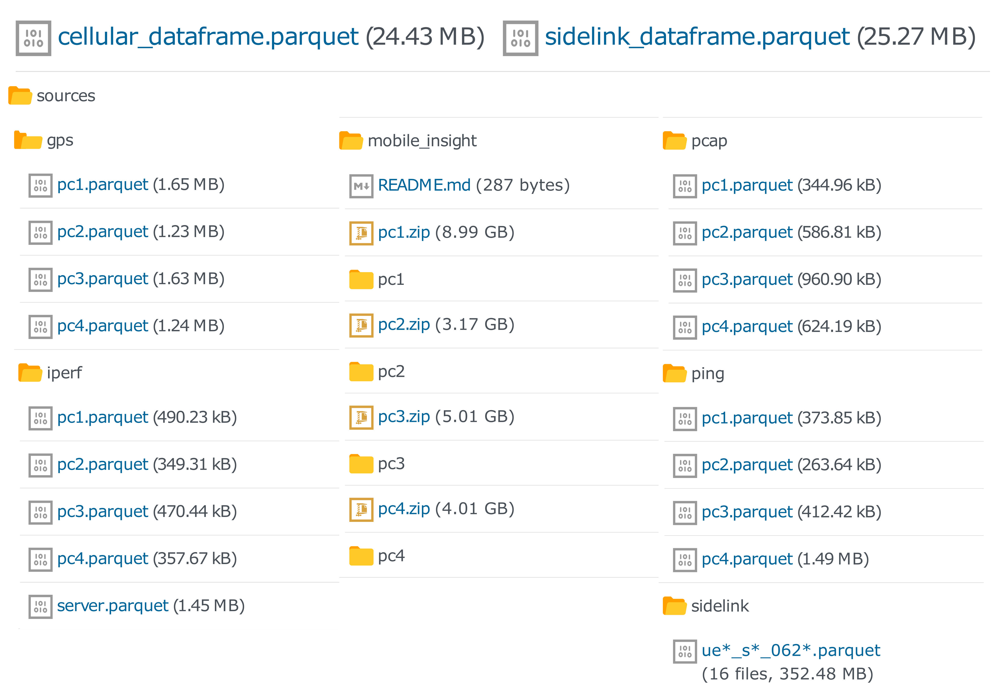

# Berlin V2X 
[][pandas]
[][numpy]
[][jupyter]

[Download the dataset on IEEE Dataport][dataport]

[dataport]: https://ieee-dataport.org/open-access/berlin-v2x
[numpy]: https://numpy.org/
[pandas]: https://pandas.pydata.org/
[jupyter]: https://jupyter.org/

The Berlin V2X dataset offers high-resolution
GPS-located wireless measurements across
diverse urban environments in the city of Berlin for both cellular and sidelink radio access technologies,
acquired with up to 4 cars over 3 days.
The data enables thus a variety of different machine learning (ML) studies towards
vehicle-to-anything (V2X) communication.

In the following, an overview of the data is provided.
For a detailed description of the measurement campaign
please refer to the [paper](https://arxiv.org/abs/2212.10343).

## Requirements

We strongly recommend to work on Python with the following libraries:

* [pandas]
* [pyarrow](https://arrow.apache.org/docs/python/index.html)

Furthermore, we suggest some additional libraries to process and analyze the data, such as:

* [numpy] for common mathematical tools
* [jupyter] to run the interactive examples
* [seaborn](https://seaborn.pydata.org/) and [matplotlib](https://matplotlib.org/) for plotting
* [folium](https://python-visualization.github.io/folium/) and related
([branca](https://github.com/python-visualization/branca),
[smopy](https://github.com/rossant/smopy)) for map visualization
* [scikit-learn](https://scikit-learn.org/stable/) for ML analysis

## File overview



Berlin V2X includes different data files in [parquet](https://parquet.apache.org/) format.
For an easy on-boarding, we provide GPS-located and labelled data frames, merged and resampled to 1 second,
for:

- Cellular measurements (_cellular_dataframe.parquet_).
- Sidelink measurements (_sidelink_dataframe.parquet_).

All data sources are also provided in high-resolution for:

- Ping traces - per car (x4).
- Iperf traces - per car (x4) for downlink measurements + server (x1) for uplink measurements.
- TCPdump data for the sidelink - per car (x4).
- GPS data - per car (x4).
- MobileInsight traces - per car (x4) and message type (x40 approx.).
  - The complete messages are zipped per device. The following message types, which have been merged into the cellular dataframe, are also provided unzipped for a quick access:
    - LTE_PHY_Serv_Cell_Measurement
    - LTE_RRC_Serv_Cell_Info
    - LTE_PHY_PDSCH_Stat_Indication
    - LTE_PHY_PUSCH_Tx_Report

| Data category    | Source            | Tool                | Sampling interval | Features                                                                                         |
|------------------|-------------------|---------------------|-------------------|--------------------------------------------------------------------------------------------------|
| Cellular         | DME               | [MobileInsight][mi] | 10 ms             | PHY: SNR, RSRP, RSRQ, RSSI                                                                       |
|                  |                   |                     | 20 ms             | PDSCH/PUSCH: Assigned RBs, TB Size, DL MCS, UL Tx Power                                          |
|                  |                   |                     | Event-based       | RRC: Cell Identity, DL/UL frequency, DL/UL bandwidth                                             |
|                  |                   | [ping]              | Event-based       | Jitter, delay                                                                                    |
|                  |                   | [iperf]             | 1 s               | DL datarate                                                                                      |
|                  | Server            | [iperf]             | 1 s               | UL Datarate                                                                                      |
| Sidelink         | SDR UE            | [tcpdump]           | Event-based       | SNR, RSRP, RSRQ, RSSI, Noise Power, Rx Power, Rx Gain                                            |
| Position         | GPS               |                     | 1 s               | Latitude, Longitude, Altitude, Velocity, Heading                                                 |
| Side information | Internet database | [HERE API][here]    | 5 min             | Traffic Jam Factor, Traffic Street Name, Traffic Distance                                        |
|                  |                   | [DarkSky][darksky]  | 1 hour            | Cloud cover, Humidity, Precipitation Intensity \& Probability, Temperature, Pressure, Wind Speed |

For merging and preprocessing details
check the notebooks in the [preprocess](preprocess) folder.

## Quickstart

You can directly load the cellular or sidelink merged dataframe in pandas and inspect the columns.
Some general information on each column can be found in
[sidelink_info.csv](./metadata/sidelink_info.csv) and [cellular_info.csv](./metadata/cellular_info.csv).

In order to reuse the code in [analyze](analyze) and [preprocess](preprocess),
place the dataset under [data](data).
The publication figures will be saved to [plots](plots).

# Data sources

[rude]: https://rude.sourceforge.net/
[mi]: http://www.mobileinsight.net/
[tcpdump]: https://www.tcpdump.org/
[iperf]: https://iperf.fr/iperf-doc.php
[ping]: https://linux.die.net/man/8/ping
[here]: https://developer.here.com/documentation/traffic-api/dev_guide/index.html
[darksky]: https://darksky.net/dev

1. [MobileInsight][mi]
2. [Iperf][iperf]
3. [Ping][ping]
4. [RUDE & CRUDE][rude]
5. [TCP Dump][tcpdump]
6. [GPS traces](#gps)
7. [Here API][here]
8. [DarkSky API][darksky]

## MobileInsight

All information captured by [MobileInsight][mi] from available LTE channels. The available information also depends on the modem of the measurement device.

Information from the following message types is provided
in the merged cellular dataframe:

- LTE_PHY_Serv_Cell_Measurement
- LTE_RRC_Serv_Cell_Info
- LTE_PHY_PDSCH_Stat_Indication
- LTE_PHY_PUSCH_Tx_Report

The merged data is based in the signal strength and quality
PHY Serving Cell information for both primary and secondary cells.
This has been enriched with RRC information on the cells
and the aggregated number of allocated
resource blocks and transport block size in downlink and uplink
from PDSCH/PUSCH, respectively.
The shared channel information also allows us to
include the transmitted power in uplink and the
modulation and coding scheme (MCS) in downlink.

More details about the preprocessing of MobileInsight
data can be found under the [mi](./mi) folder.

## Iperf

[Iperf][iperf] is a speed test application that enables measuring the bandwidth and jitter of a UDP or TCP connection.

In the measurement campaign, Iperf was run on both a DME and server to receive throughput measurements with a granularity of **1s**.
For experiments that require high accuracy. The iperf measurements that have been merged in the cellular dataframe
are extracted from the destination, i.e., DME for downlink and server for uplink.

## Ping

Collected from the console command `ping`,
it provides the delay measurements.

## RUDE

The packets were transmitted according to scenarios S1 and S2:

- **S1**: Cooperative awareness messages (CAM) of length 69
bytes at a packet transmission rate of 20 Hz and modulation
and coding scheme (MCS) 8 using two sub-channels.
- **S2**: Collective perception messages (CPM) of length 1000
bytes (including IP header and payload) at a rate of 50 Hz
with MCS 12 using ten sub-channels.

We aggregate the information on the received packets down to 1 second to estimate packet error rate.
For a detailed insight of the sidelink signal parameters, check the dataset publication or RUDE's [documentation][rude].


## TCP Dump

[TCP Dump][tcpdump] is a packet analyzer that allows tracking transmitted packets and their properties (e.g. payload, size of the packet). 
The received sidelink packages were decoded with TCPdump and parsed into parquet files for every receiver.
The sidelink data extracted from the incoming messages for any given sidelink UE are provided as separate parquet files.

## GPS

GPS data is collected for each device with a
granularity of 1 second.

The GPS traces are enriched with the variable
`Pos in Ref Round`, i.e.,
the position in the reference round. This variable is a
mapping of the latitude and longitude into 
the distance that was driven by an arbitrarily chosen car from an arbitrarily chosen point in an arbitrarily chosen round.
In this way, `Pos in Ref Round` allows the analysis
of wireless parameters against a single 1-dimensional spatial value
(Check [add_pos_in_ref_round.ipynb](preprocess/add_pos_in_ref_round.ipynb)
for details).
For the sidelink data,
the distance between cars is also provided.

Distance is computed in all cases after conversion
to planar coordinates for simplicity.
The error should be negligible due to the small area that is covered by the data.

The merged GPS traces in the
[IEEE dataport][dataport] also
include the side information from
the APIs
[HERE][here] and [DarkSky][darksky].


## HERE API

The information about traffic density was downloaded from the
[HERE Traffic API][here] every 5 minutes during the measurements.

For determining the Traffic Jam Factor at a given location the closest route from the API data was calculated. For debugging purposes the name of the street where this Traffic Jam Factor was taken from is saved in the Traffic Street Name column and the distance to this street is saved in the Traffic Distance column.

## DarkSky

The information about Cloud cover, Humidity, Precipitation Intensity & Probability, Temperature, Pressure and Wind Speed was downloaded from the
[DarkSky API][darksky].

Time granularity is 1 hour and location granularity is 0.01 degrees in both latitude and longitude.

# Reference

## Examples


The code to generate the publication figures can be found in 
the [analyze](analyze) folder.

## AI4Mobile

AI4Mobile is a research project funded by the
[Federal Ministry for Education and Research (BMBF)](https://www.bmbf.de/bmbf/en/home/),
from the announcement
[Artificial Intelligence in Communication Networks](https://www.forschung-it-sicherheit-kommunikationssysteme.de/foerderung/bekanntmachungen/kikom)
within the scope of the High-Tech Strategy of the German Federal Government.

The scope of the project is the study
of AI-aided wireless systems for mobility in industry and traffic.
More information at [ai4mobile.org](https://www.ai4mobile.org/en/).

## Citation

If you use the dataset, please cite it as:

```bibtex
@article{hernangomez2022berlin,
    title = {Berlin {{V2X}}: {{A Machine Learning Dataset}} from {{Multiple Vehicles}} and {{Radio Access Technologies}}},
    shorttitle = {Berlin {{V2X}}},
    author = {Hernang{\'o}mez, Rodrigo and Geuer, Philipp and Palaios, Alexandros and Sch{\"a}ufele, Daniel and Watermann, Cara and {Taleb-Bouhemadi}, Khawla and Parvini, Mohammad and Krause, Anton and Partani, Sanket and Vielhaus, Christian and Kasparick, Martin and K{\"u}lzer, Daniel F. and Burmeister, Friedrich and Sta{\'n}czak, S{\l}awomir and Fettweis, Gerhard and Schotten, Hans D. and Fitzek, Frank H. P.},
    year = {2022},
    month = dec,
    number = {arXiv:2212.10343},
    eprint = {2212.10343},
    eprinttype = {arxiv},
    primaryclass = {cs},
    publisher = {{arXiv}},
    doi = {10.48550/arXiv.2212.10343},
    archiveprefix = {arXiv},
    keywords = {Computer Science - Artificial Intelligence,Computer Science - Machine Learning,Computer Science - Networking and Internet Architecture}
}
```


